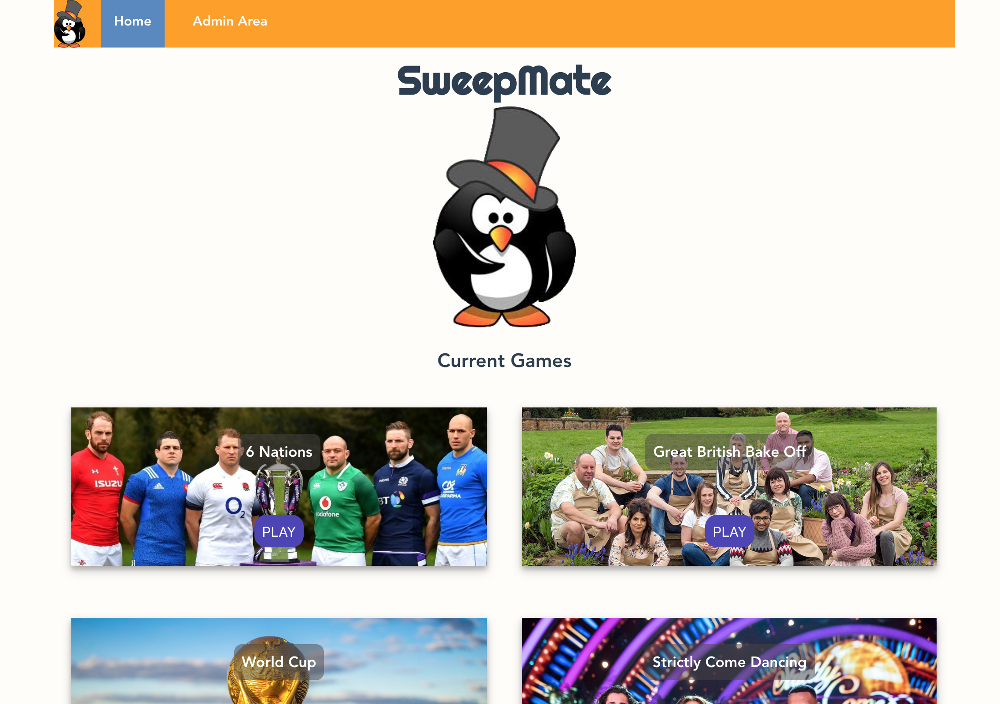
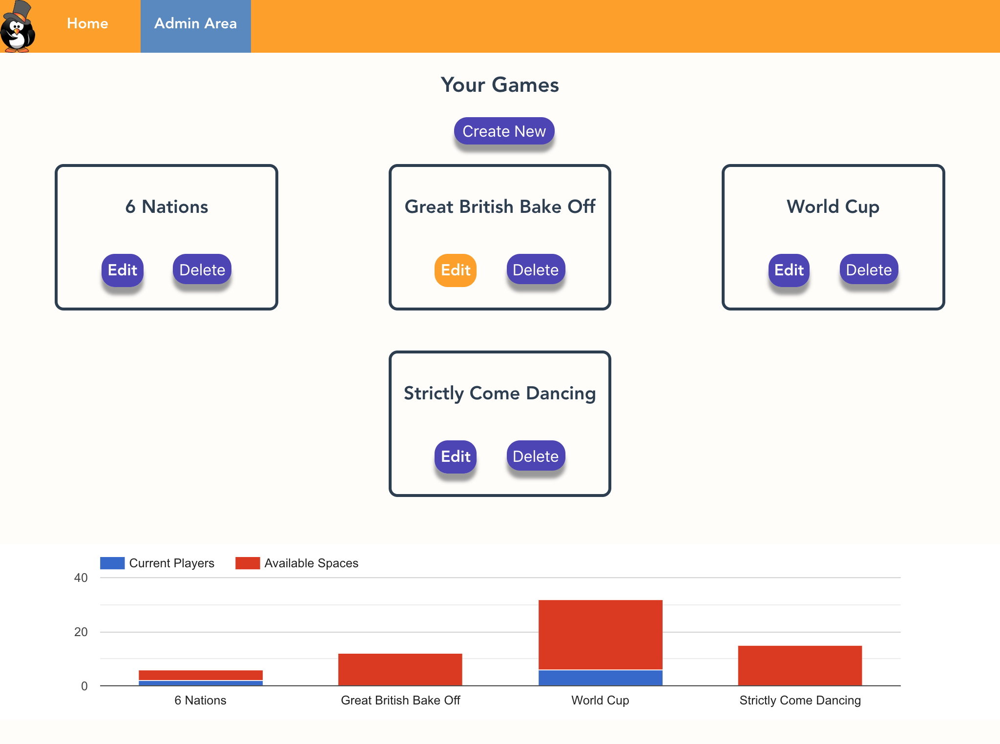
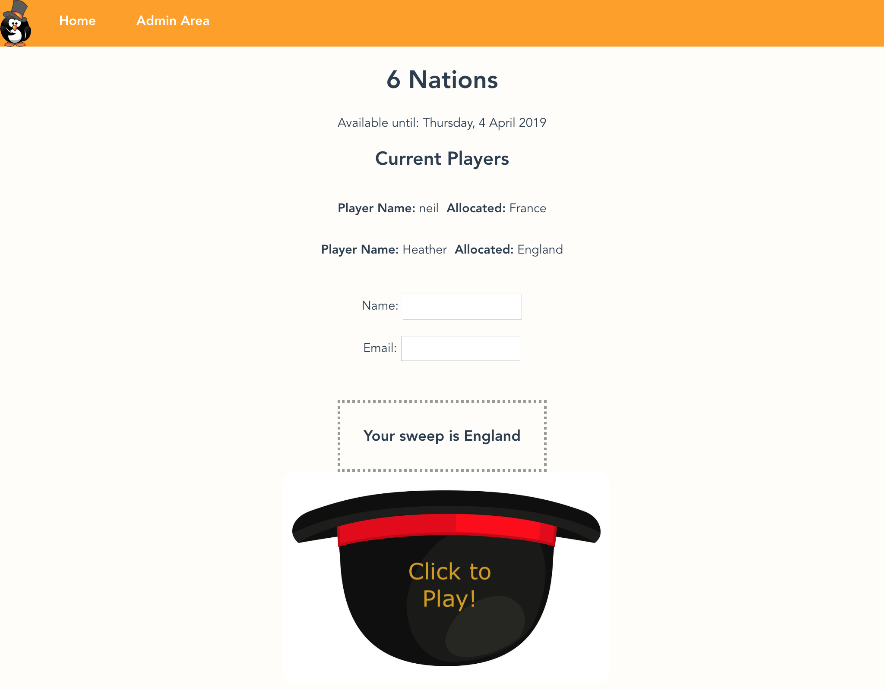

# Sweep Mate App

## Project description

A JavaScript Vue team project where we created our own idea and wrote our own MVP and extensions.

We used:

Vue
MongoDB
Express
Vue Router

[Project Brief](https://docs.google.com/document/d/1vCGD2b0vEZHtS5IpPZ15Q1bC1y0Bib5UXRWCcfOLUq4/edit#heading=h.a5obb37bjms1)

## Screen Grabs

_screen home_

_admin home_

_play sweep_

## Installation Instructions

[Client](./sweep_mate_client/README.md)

[Server](./server/README.md)
